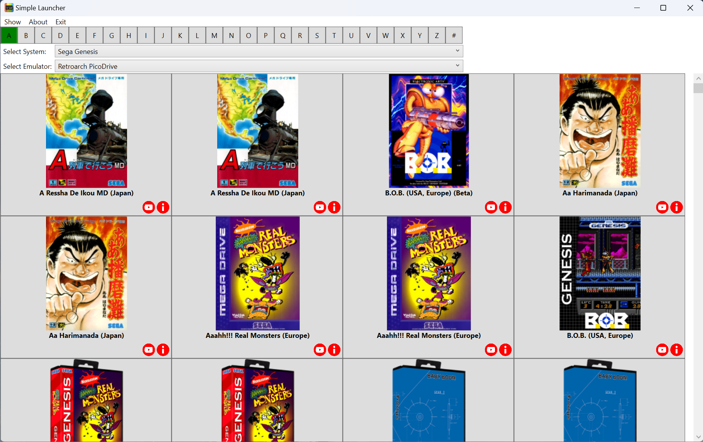
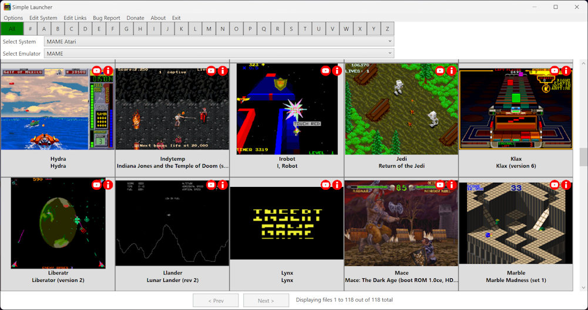
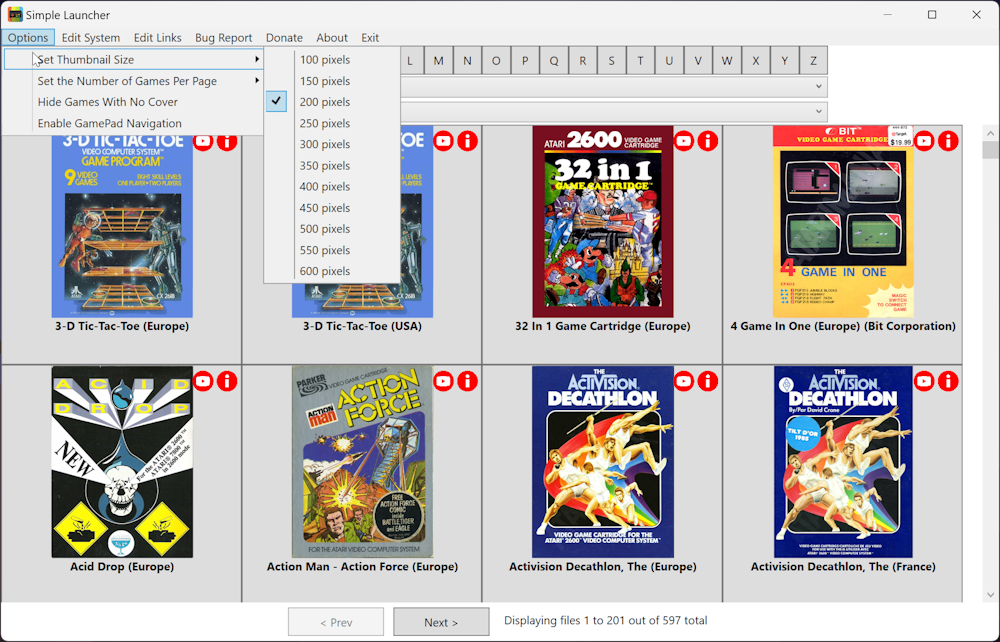

# Simple Launcher

Simple Launcher is a free program for Windows that lets you play games on emulators with ease.<br>



## How it Works:

- **Configuration:** The program looks for a file called "system.xml" in its folder, which holds all the system and emulator settings. You should edit this file to comply wich your needs.

- **Game Selection:** When you choose a system, the application opens the system directory and the list of emulators configured for that specific system. It then creates a grid of games located inside the system folder. Each cell of the grid is clickable, and the app will launch the selected emulator with the chosen game.

- **Game Info:** Each grid cell shows a game cover, its name, a link to a YouTube video about the game, and an info link.

- **Game Covers:** The cover images should have the same filename as the game. They are loaded from a folder inside the images folder, which should have the same name as the system. The images must be in PNG, JPG or JPEG format. If a cover is missing, it uses a default image.<br>



## Where to Find Game Covers:

You can find cover images on websites like https://github.com/libretro-thumbnails/libretro-thumbnails or https://emumovies.com/, but these sites are not affiliated with Simple Launcher.

## Configuration File ("system.xml"):

This file holds information about different systems and their settings. You can add as many systems and emulators as you want.

- **SystemName**: Name of the system.

- **SystemFolder**: Folder where the ROMs or games are located.

- **SystemIsMAME**: Notify the program whether the system is based on MAME or not. If true, the application will load the ROM descriptions alongside the ROM filenames.

- **FormatToSearch**: List of file extensions that will be loaded from the SystemFolder. You can use as many as you want.

- **ExtractFileBeforeLaunch**: Should be true or false. If true, the launcher will extract the zip or 7z file into a temp folder, then it will load the extracted file.

- **FormatToLaunch**: In case you extract the file to a temp folder. You should specify here which extensions will be launched from the extracted folder.

- **EmulatorName**: Name of the emulator. You can add as many emulators as you want for each system.

- **EmulatorLocation**: Location of the emulator.

- **EmulatorParameters**: Parameters that are used for each emulator. Not all emulators need parameters.

```xml
<SystemConfigs>
    <SystemConfig>
        <SystemName>Amstrad CPC GX4000</SystemName>
        <SystemFolder>G:\OK\Amstrad CPC GX4000</SystemFolder>
        <SystemIsMAME>false</SystemIsMAME>
        <FileFormatsToSearch>
            <FormatToSearch>zip</FormatToSearch>
            <FormatToSearch>7zip</FormatToSearch>
        </FileFormatsToSearch>
        <ExtractFileBeforeLaunch>false</ExtractFileBeforeLaunch>
        <FileFormatsToLaunch>
            <FormatToLaunch></FormatToLaunch>
            <FormatToLaunch></FormatToLaunch>
        </FileFormatsToLaunch>
        <Emulators>
            <Emulator>
                <EmulatorName>Retroarch</EmulatorName>
                <EmulatorLocation>G:\Emulators\RetroArch\retroarch.exe</EmulatorLocation>
                <EmulatorParameters>-L "G:\Emulators\Retroarch\cores\cap32_libretro.dll" -c "G:\Emulators\Retroarch\Config.cfg" -f</EmulatorParameters>
            </Emulator>
        </Emulators>
    </SystemConfig>
</SystemConfigs>
```

## User Preferences ("settings.xml"):

This file contains your preferences for the program, such as thumbnail size, hiding games without covers, and enabling GamePad navigation.

- **ThumbnailSize**: Height of the thumbnail.

- **HideGamesWithNoCover**: Whether to hide games without a cover.

- **EnableGamePadNavigation**: Whether to enable GamePad navigation.

```xml
<Settings>
	<ThumbnailSize>350</ThumbnailSize>
	<HideGamesWithNoCover>false</HideGamesWithNoCover>
	<EnableGamePadNavigation>true</EnableGamePadNavigation>
</Settings>
```


## Additional Features:

- **Update Notifications:** You'll be notified if a new version is available.

- **Error Logging:** The aplication also has an error logging mechanism that notify the developers of any errors that may occur. This way we can fix bugs and improve the program over time.

## Technical Details:

Simple Launcher is written in C# using Microsoft Visual Studio Community 2022 (64-bit) and the Windows Presentation Foundation (WPF) Framework with Microsoft .NET 8.0.

This program is Windows-only and has been tested on Windows 11.

## Contributors
- **Peterson Fernandes** - [Github Profile](https://github.com/drpetersonfernandes)
- **RFSVIEIRA** - [Github Profile](https://github.com/RFSVIEIRA)
