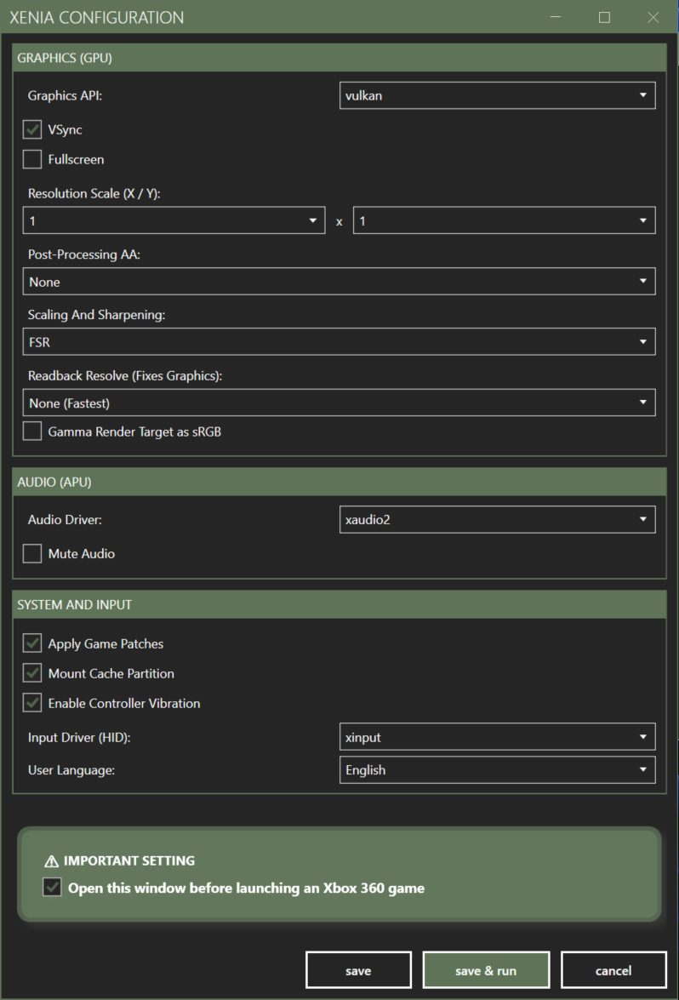

# 🎮 Simple Launcher

**Simple Launcher** is a high-performance, open-source emulator frontend built with C# and WPF. Designed for both casual gamers and power users, it provides a seamless interface to organize, browse, and launch your retro gaming collection with deep integration for modern emulators and RetroAchievements.

---

## 📸 Screenshots

**System Selection**
**List Of Games in Grid Mode**
**List Of Games in List Mode**
**RetroAchievements Window**
**RetroAchievements Window**
**Inject Configuration Window for Emulator Xenia**

## ✨ Key Features

### 🚀 Performance & Core Infrastructure
*   **MessagePack Engine:** Powered by a high-speed MessagePack serialization system for near-instant settings loading and improved application responsiveness.
*   **Native ARM64 Support:** Fully optimized for Windows on ARM (e.g., Surface Pro, Snapdragon X Elite) alongside standard x64 systems.
*   **Asynchronous Architecture:** Multi-threaded game scanning and validation ensure the UI remains fluid even with massive libraries.
*   **Single Instance Enforcement:** Prevents resource conflicts by ensuring only one instance of the launcher runs at a time.

### 🎮 Deep Emulator Integration
*   **Configuration Injection:** Manage and inject settings directly into 20+ popular emulators (Ares, Dolphin, DuckStation, Flycast, RPCS3, Xenia, and more) without leaving the launcher.
*   **On-the-Fly Mounting:** Launch games directly from compressed (`.zip`) or disk image (`.iso`, `.xiso`) files using **Dokan** integration. Supports RPCS3, Cxbx-Reloaded, ScummVM, and XBLA.
*   **Expert Mode:** Granular control over launch parameters, multiple ROM paths per system, and custom environment variables.

### 🏆 RetroAchievements (RA) Integration
*   **Rich User Profiles:** View your RA stats, recently played games, and global rankings directly in the UI.
*   **Auto-Credential Injection:** Automatically syncs your RA login to supported emulators like PCSX2, DuckStation, PPSSPP, and RetroArch.
*   **Advanced Hashing:** Built-in logic to calculate precise hashes for complex systems (PS1, Saturn, Dreamcast) to ensure achievement tracking.

### 📂 Library Management
*   **Dual View Modes:** Toggle between a visual **Grid View** with customizable aspect ratios and a detailed **List View** with sortable metadata.
*   **Fuzzy Image Matching:** Intelligent algorithm to find cover art even if filenames don't match perfectly.
*   **Play History Tracking:** Detailed logs of play count, total playtime, and last played timestamps using absolute file paths.
*   **Global Search:** Advanced search engine supporting `AND`/`OR` operators across your entire multi-system library.

---

## 🛠️ Bundled Power Tools

Simple Launcher includes a suite of specialized utilities for library maintenance:
*   **Format Converters:** Batch convert to **CHD**, **RVZ**, **XISO**, or **Compressed (7z/Zip)** with built-in integrity verification.
*   **Metadata Tools:** Scrape game covers, organize system images, and validate ROMs against No-Intro DAT files.
*   **Batch Creators:** Automatically generate launch scripts for PS3, ScummVM, Sega Model 3, and Windows Store games.

---

## 📥 Installation

1.  **Download:** Grab the latest release for your architecture (x64 or ARM64) from the [Releases Page](https://github.com/drpetersonfernandes/SimpleLauncher/releases).
2.  **Extract:** Unzip the contents into a **writable folder** (e.g., `C:\Games\SimpleLauncher`). 
    *   *Note: Do not install in `C:\Program Files` to avoid permission issues.*
3.  **Prerequisites:** 
    *   Install **Dokan** from [GitHub](https://github.com/dokan-dev/dokany/releases) for on-the-fly file mounting.
    *   Ensure you have the [.NET 10 Runtime](https://dotnet.microsoft.com/download) installed.

---

## 🚦 Getting Started

1.  **Easy Mode:** Click the **Easy Mode** menu item to automatically download and configure emulators for your chosen systems.
2.  **Add Games:** Place your ROMs and cover images in the folders designated during setup.
3.  **Select System:** Use the visual **System Selection Screen** to pick your platform.
4.  **Play:** Click a game cover to launch. Use a Gamepad (Xbox or PlayStation) to navigate the entire interface.

---

## 🌐 Localization

Simple Launcher is translated into **17 languages**:
*   English, Spanish, French, German, Italian, Portuguese (BR), Russian, Chinese (Simplified), Japanese, Korean, Arabic, Bengali, Hindi, Indonesian, Dutch, Turkish, and Urdu.

---

## 💻 Technical Specifications

*   **Framework:** .NET 10 (WPF)
*   **Language:** C# 14
*   **Data Serialization:** MessagePack (Binary) & XML
*   **Dependencies:** MahApps.Metro (UI), SharpDX (Input), SevenZipSharp (Archives), DokanNet (Mounting).

---

## 🤝 Contributing & Support

*   **Bug Reports:** Use the built-in **Support Window** to send detailed error reports directly to the developers.
*   **Wiki:** Check our [GitHub Wiki](https://github.com/drpetersonfernandes/SimpleLauncher/wiki) for advanced parameter guides.
*   **Donate:** If you find this project useful, consider [supporting the developer](https://www.purelogiccode.com/donate).

**⭐ If you like this project, please give us a star on GitHub! ⭐**

---

## 📜 License

This project is licensed under the GPLv3 License – see the [LICENSE](LICENSE.txt) file for details.

*Simple Launcher is an emulator frontend and does not provide ROMs, ISOs, or BIOS files.*