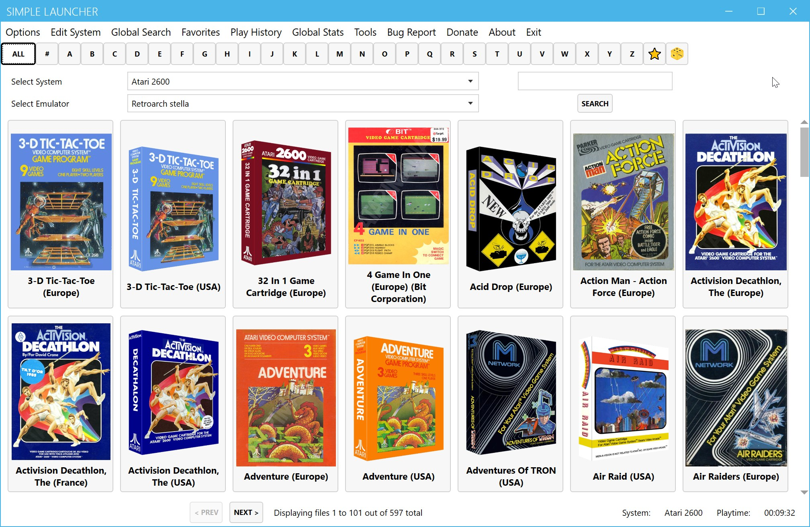

**Simple Launcher**
===============

A simple emulator launcher for Windows.  

 
This program searches for any ZIP, 7Z, ISO, CHD, or CSO file in the current directory.
It then displays the list of files in a grid with a cover image (on top) and the filename (at the bottom).

Cover images should have the same filename as the file to be launched. All images should be placed inside the "images" folder. They must be in PNG format and it's recommended for the images to have a height of 200 pixels. Using a higher resolution image will consume more memory. If the main program doesn't find an image with the matching filename inside the images folder, it will load "default.png".

At the top of the program, there's a combo box that allows the user to select an emulator to use.

All the emulator settings and parameters are stored in the "emulator.ini" file, located in the same directory as the launcher.

The format of the "emulator.ini" file is as follows:

<pre>
Id: 1
ProgramName: Retroarch snes9x_libretro
ProgramLocation: G:\Emulators\Retroarch\retroarch.exe
Parameters: -L "G:\Emulators\Retroarch\cores\snes9x_libretro.dll" -c "G:\Emulators\Retroarch\Config.cfg" -f

Id: 2
ProgramName: Retroarch picodrive_libretro
ProgramLocation: G:\Emulators\Retroarch\retroarch.exe
Parameters: -L "G:\Emulators\Retroarch\cores\picodrive_libretro.dll" -c "G:\Emulators\Retroarch\Config.cfg" -f
</pre>
You can add as many emulators as you want. The "ProgramName" is the name that will be displayed in the combo box. The "ProgramLocation" is the path to the emulator executable, and "Parameters" are the parameters that will be passed to the emulator executable. Please follow the format provided in this example.

When the user clicks on the selected grid, the program will launch the selected emulator with the specified parameters and the chosen file.

This program is Windows-only and has been tested on Windows 11.

### Code Language
*Written in C# using 
Microsoft Visual Studio Community 2022 Version 17.8.0 Preview 1.0 
Windows Presentation Foundation (WPF) Framework 
Microsoft .NET Framework Version 4.8.09032*

### Contributors
- Peterson Fernandes - [Github Profile](https://github.com/drpetersonfernandes)
- RFSVIEIRA - [Github Profile](https://github.com/RFSVIEIRA)
