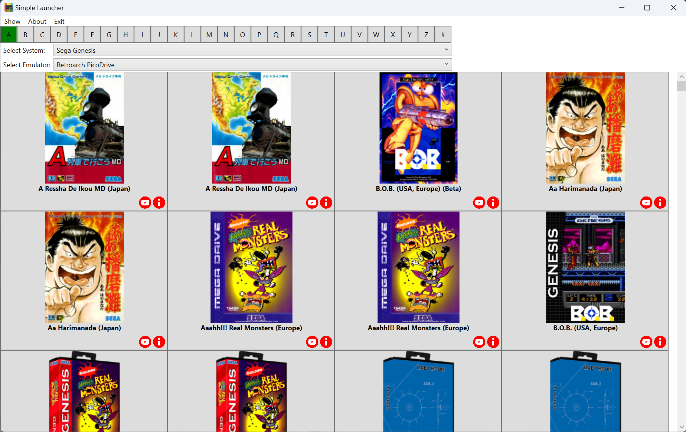
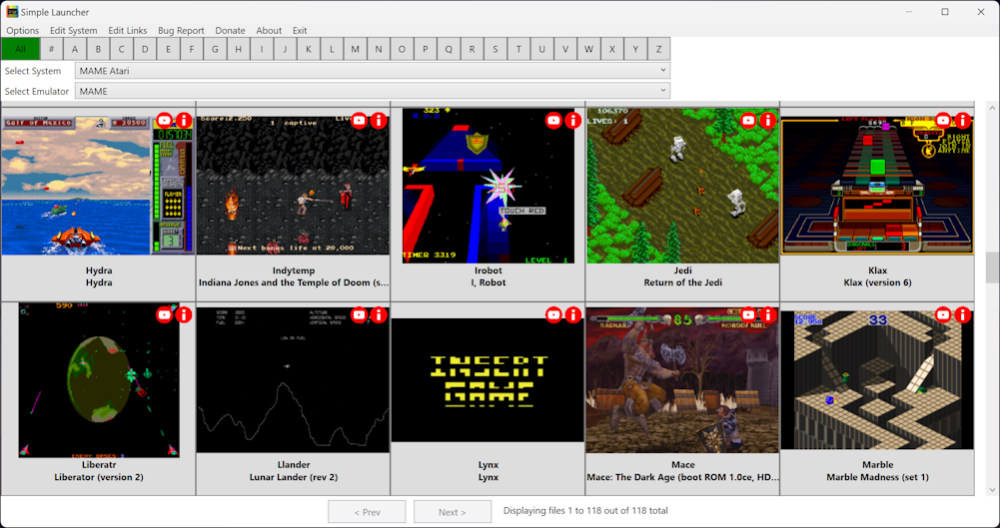
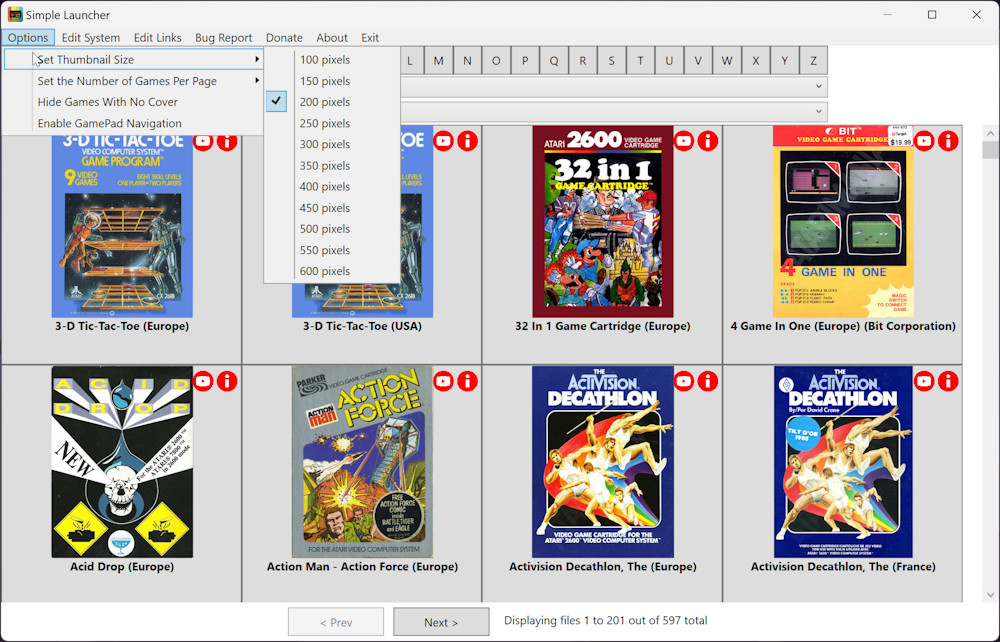
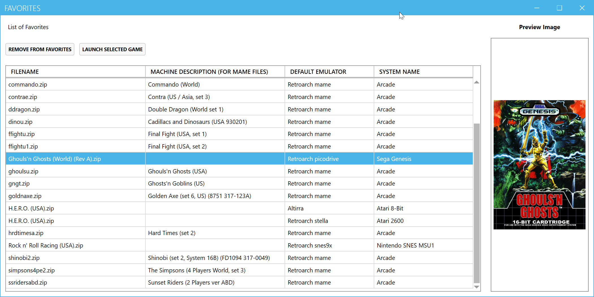
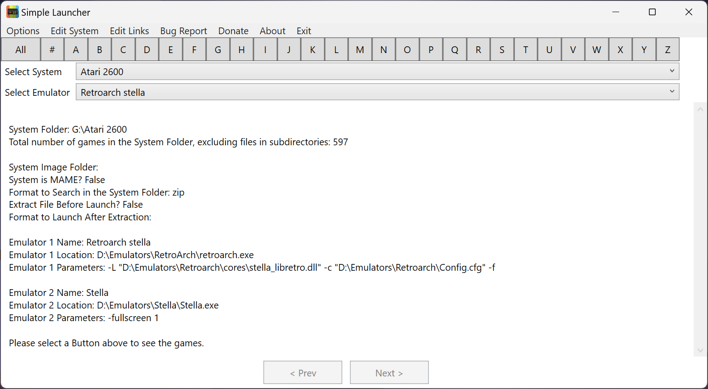
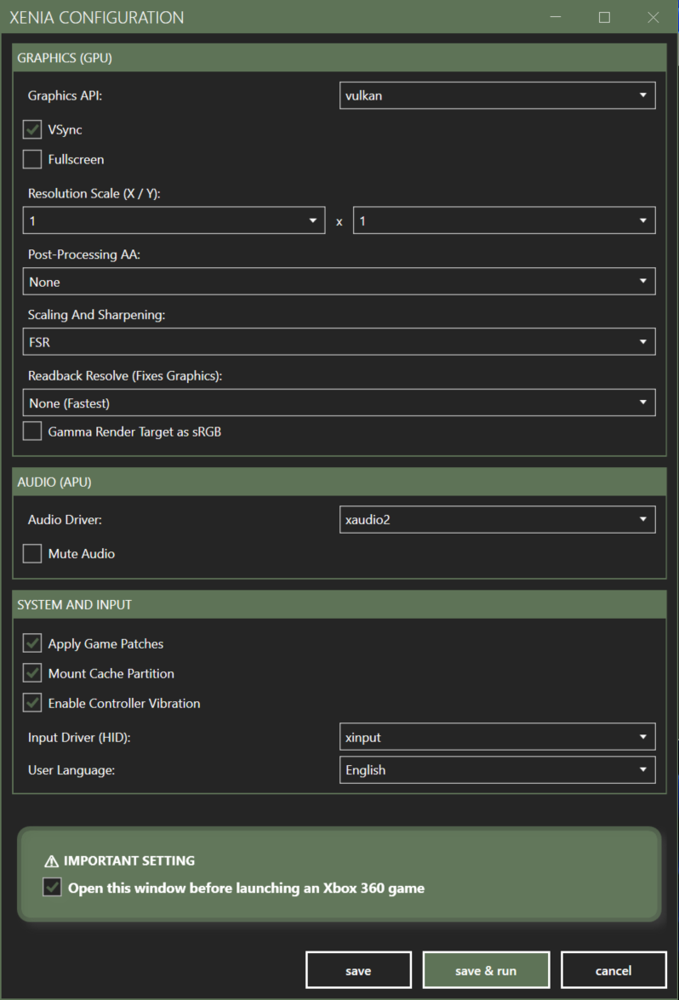

# 🎮 Simple Launcher

**Simple Launcher** is a high-performance, open-source emulator frontend built with C# and WPF. Designed for both casual gamers and power users, it provides a seamless interface to organize, browse, and launch your retro gaming collection with deep integration for modern emulators and RetroAchievements.

---

## 📸 Screenshots

**System Selection**

**List Of Games in Grid Mode**

**List Of Games in List Mode**

**RetroAchievements Window**

**RetroAchievements Window**

**Inject Configuration Window for Emulator Xenia**

---

## ✨ Feature List

### 🚀 Performance & Core Infrastructure
* **MessagePack Engine:** High-speed MessagePack serialization for near-instant settings loading
* **Native ARM64 Support:** Fully optimized for Windows on ARM (Surface Pro, Snapdragon X Elite) alongside x64
* **Asynchronous Architecture:** Multi-threaded game scanning and validation with fluid UI
* **Single Instance Enforcement:** Prevents resource conflicts by ensuring only one instance runs
* **Elevation Detection:** Automatically detects games requiring Administrator privileges
* **Startup Validation:** Detects if running from temporary folders and prompts for proper extraction
* **Secure Connections:** All metadata and image downloads use TLS 1.2/1.3
* **Resilient Saving:** Improved file lock handling with retry logic and exponential backoff

### 🎮 Deep Emulator Integration
* **Configuration Injection:** Manage and inject settings directly into 20+ popular emulators:
  - Ares, Azahar, Blastem, Cemu, Daphne, Dolphin, DuckStation, Flycast, MAME, Mednafen, Mesen, PCSX2, Raine, Redream, RetroArch, RPCS3, Sega Model 2, Stella, Supermodel, Xenia, Yumir
* **Universal CHD Support:** Built-in **CHDMounter** utility brings CHD support to emulators without native support:
  - RPCS3, Xemu, Xenia, Cxbx-Reloaded, Mednafen, PCSX Redux, 4DO, Gens, Blastem, Yabause, Mesen, FinalBurn Neo, FinalBurn Alpha, Raine, CD-i Emulator, Tsugaru
* **On-the-Fly Mounting:** Launch games directly from compressed (`.zip`) or disk image (`.iso`, `.xiso`) files using **Dokan** integration
* **Expert Mode:** Granular control over launch parameters, multiple ROM paths per system, and custom environment variables
* **Format Conversion:** Built-in converters for CHD, RVZ, XISO, 7z/Zip with integrity verification
* **File Mounting Strategies:** Advanced strategies for XISO, CHD, ZIP, PBP-to-CUE, and CHD-to-CUE conversions

### 🏆 RetroAchievements (RA) Integration
* **Rich User Profiles:** View RA stats, recently played games, and global rankings directly in UI
* **Auto-Credential Injection:** Automatically syncs RA login to supported emulators (PCSX2, DuckStation, PPSSPP, RetroArch)
* **Advanced Hashing:** Built-in logic for precise hashes for complex systems (PS1, Saturn, Dreamcast)
* **Nintendo Wii Support:** Full support for Wii RetroAchievements
* **Expanded System Aliases:** Better matching for NEC PC-FX, SNES MSU1, and many more systems
* **RA Data Fetcher Tool:** Separate tool for fetching RetroAchievements data

### 📂 Library Management & Game Scanning
* **Dual View Modes:** Toggle between visual **Grid View** with customizable aspect ratios and detailed **List View** with sortable metadata
* **Modern Game Store Integration:** Automatic scanning for games from:
  - Microsoft Store (Windows Apps)
  - Steam
  - Epic Games Store
  - GOG
  - Amazon Games
  - Battle.net
  - EA App
  - Humble Bundle
  - itch.io
  - Rockstar Games
  - Uplay
* **Fuzzy Image Matching:** Intelligent algorithm to find cover art even with imperfect filename matches
* **Play History Tracking:** Detailed logs of play count, total playtime, and last played timestamps
* **Global Search:** Advanced search engine supporting `AND`/`OR` operators across entire multi-system library
* **Favorites System:** Mark and organize favorite games with persistent storage
* **Gamepad Navigation:** Full navigation support for Xbox and PlayStation controllers
* **Pagination System:** Efficient handling of large game libraries with batch loading

### 🎨 Customization & UI Features
* **Multiple Themes:** Beautiful **Midnight** (Deep Blue) theme, **High Contrast** mode, and Adaptive mode syncing with Windows Light/Dark settings
* **Filename Preferences:** "Clean Up" filenames in Grid View or hide filenames entirely for pure box-art look
* **Font Size Control:** Customize filename and machine name font sizes in game buttons
* **Separate Thumbnail Sizes:** Independent zoom controls for system selection and game view
* **Aspect Ratio Control:** Customize game button aspect ratios
* **Sound Configuration:** Customizable sound effects for UI interactions
* **Tray Icon Support:** Minimize to system tray with quick access
* **Right-Click Context Menus:** Extensive context menu options for games and systems
* **Filter Menu System:** Advanced filtering options for game libraries

### 🛠️ Bundled Power Tools
Simple Launcher includes a comprehensive suite of specialized utilities:

* **CHDMounter:** Automatically handles CHD file mounting for emulators without native support
* **Format Converters:**
  - BatchConvertToCHD: Convert to CHD format
  - BatchConvertToRVZ: Convert to RVZ format (Dolphin)
  - BatchConvertIsoToXiso: Convert ISO to XISO format
  - BatchConvertToCompressedFile: Convert to 7z/Zip format
  - PSXPackager: Package PS1 games
* **Metadata & Cover Tools:**
  - FindRomCover: Intelligent cover art finder
  - GameCoverScraper: Web-based cover art scraper
  - RetroGameCoverDownloader: Download retro game covers
* **Batch File Creators:**
  - CreateBatchFilesForPS3Games: PS3 game launchers
  - CreateBatchFilesForScummVMGames: ScummVM game launchers
  - CreateBatchFilesForWindowsGames: Windows game launchers
  - CreateBatchFilesForXbox360XBLAGames: Xbox 360 XBLA launchers
* **Validation & Organization:**
  - RomValidator: Validate ROMs against No-Intro DAT files
  - MAME.DatCreator: Create MAME DAT files
  - SimpleZipDrive: ZIP file mounting utility
  - SimpleXisoDrive: XISO file mounting utility
* **File System Tools:**
  - RAHasher: RetroAchievements hash calculator
  - 7z integration for compression/decompression

### 🔧 Advanced Features
* **Easy Mode:** One-click automatic download and configuration of emulators for chosen systems
* **System Selection Screen:** Visual system selection with customizable thumbnails
* **Gamepad Dead Zone Configuration:** Customize controller dead zones for precise navigation
* **Fuzzy Matching Configuration:** Adjust matching thresholds for cover art and metadata
* **Play Time Tracking:** Refactored from strings to seconds for better accuracy
* **Global Statistics:** View usage statistics and play time across all systems
* **Image Viewer:** Built-in image viewer for game art and screenshots
* **Debug Window:** Advanced debugging and error reporting interface
* **Update System:** Built-in updater with version checking
* **Multi-language Support:** 17 languages with localization system
* **Accessibility Features:** Automation properties, access keys, and high contrast mode

### 📊 Supported Systems (100+ Systems)
The launcher supports an extensive range of gaming systems including:
- **Nintendo:** NES, SNES, N64, GameCube, Wii, Wii U, Switch, Game Boy, GBC, GBA, DS, 3DS, Virtual Boy, Famicom, Satellaview, 64DD
- **Sony:** PlayStation 1-4, PSP, PS Vita
- **Microsoft:** Xbox, Xbox 360, Windows, DOS
- **Sega:** Master System, Genesis, Saturn, Dreamcast, Game Gear, SG-1000, Model 3, Naomi, Naomi 2, Atomiswave
- **Arcade:** MAME, FinalBurn Neo, FinalBurn Alpha, Raine
- **Retro Computers:** Amiga, Amstrad CPC, Commodore 64, Commodore 128, ZX Spectrum, MSX, MSX2, Sharp X68000
- **Classic Consoles:** Atari 2600-7800, Jaguar, Lynx, ColecoVision, Intellivision, Neo Geo, Neo Geo CD, TurboGrafx-16, PC Engine, 3DO, CD-i
- **Modern Platforms:** ScummVM, Windows Store games, Xbox 360 XBLA

### 💿 CHD Support Matrix
| Emulator | CHD Support | Notes |
|----------|-------------|-------|
| RPCS3 | ✅ Added | PlayStation 3 |
| Xemu | ✅ Added | Original Xbox |
| Xenia | ✅ Added | Xbox 360 |
| Cxbx-Reloaded | ✅ Added | Original Xbox |
| Mednafen | ✅ Added | Multi-system |
| PCSX-Redux | ✅ Added | PlayStation 1 |
| 4DO | ✅ Added | 3DO |
| Gens | ✅ Added | Sega Genesis |
| Blastem | ✅ Added | Sega Genesis |
| Yabause | ✅ Added | Sega Saturn |
| Mesen | ✅ Added | NES, SNES |
| FinalBurn Neo | ✅ Added | Arcade |
| FinalBurn Alpha | ✅ Added | Arcade |
| Raine | ✅ Added | Arcade |
| CD-i Emulator | ✅ Added | Philips CD-i |
| Tsugaru | ✅ Added | FM Towns |

---

## 📥 Installation

1. **Download:** Grab the latest release for your architecture (x64 or ARM64) from the [Releases Page](https://github.com/drpetersonfernandes/SimpleLauncher/releases).
2. **Extract:** Unzip the contents into a **writable folder** (e.g., `C:\Games\SimpleLauncher`).
   * *Note: Do not install in `C:\Program Files` to avoid permission issues.*
3. **Prerequisites:**
   * Install **Dokan** from [GitHub](https://github.com/dokan-dev/dokany/releases) for on-the-fly file mounting.
   * Ensure you have the [.NET 10 Runtime](https://dotnet.microsoft.com/download) installed.

---

## 🚦 Getting Started

1. **Easy Mode:** Click the **Easy Mode** menu item to automatically download and configure emulators for your chosen systems.
2. **Add Games:** Place your ROMs and cover images in the folders designated during setup.
3. **Select System:** Use the visual **System Selection Screen** to pick your platform.
4. **Play:** Click a game cover to launch. Use a Gamepad (Xbox or PlayStation) to navigate the entire interface.

---

## 🌐 Localization

Simple Launcher is translated into **17 languages**:
* English, Spanish, French, German, Italian, Portuguese (BR), Russian, Chinese (Simplified), Japanese, Korean, Arabic, Bengali, Hindi, Indonesian, Dutch, Turkish, and Urdu.

---

## 💻 Technical Specifications

* **Framework:** .NET 10 (WPF)
* **Language:** C# 14
* **Data Serialization:** MessagePack (Binary) & XML
* **Dependencies:** MahApps.Metro (UI), SharpDX (Input), SevenZipSharp (Archives), DokanNet (Mounting), YamlDotNet, Tomlyn, SharpCompress
* **Architecture:** Modular service-based architecture with dependency injection
* **Storage:** SQLite for play history, MessagePack for favorites, XML for settings

---

## 🤝 Contributing & Support

* **Bug Reports:** Use the built-in **Support Window** to send detailed error reports directly to the developers.
* **Documentation:** Comprehensive `parameters.md` with official emulator download links and parameter documentation
* **Wiki:** Check our [GitHub Wiki](https://github.com/drpetersonfernandes/SimpleLauncher/wiki) for advanced parameter guides.
* **Donate:** If you find this project useful, consider [supporting the developer](https://www.purelogiccode.com/donate).

**⭐ If you like this project, please give us a star on GitHub! ⭐**

---

## 📜 License

This project is licensed under the GPLv3 License – see the [LICENSE](LICENSE.txt) file for details.

*Simple Launcher is an emulator frontend and does not provide ROMs, ISOs, or BIOS files.*