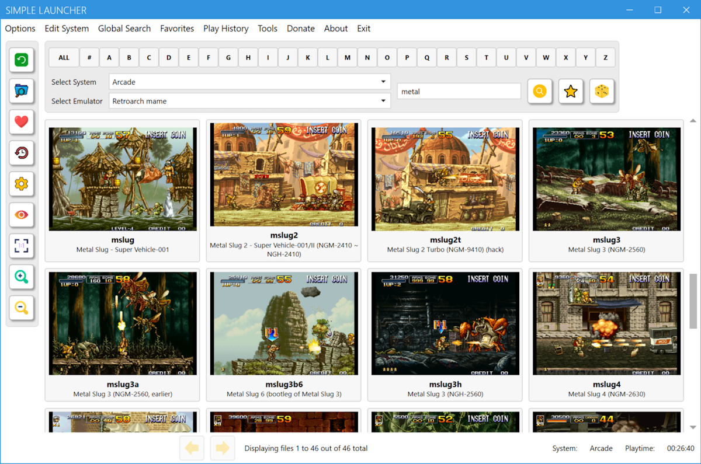

# Simple Launcher

Simple Launcher is an Emulator Frontend that lets you play retro games with ease.

## Installation

You just need to download the application from the [release page](https://github.com/drpetersonfernandes/SimpleLauncher/releases), then extract the zip file to your chosen folder.

## Usage

* Click on the Edit System on the top menu.
* Configure each System you wish. You can add, edit or delete Systems.
* Create a folder inside images folder with the same name of the System you just created.
* Put all your cover images for that specific System inside that folder.
* Now you select the System in the dropdown menu on top of the app.
* Select the Emulator you want to use.
* Click the desired Letter on the top of the application.
* Click on the game you want to launch.

## Where to Find Game Covers:

We do NOT provide ROMs, ISOs or Game Covers. 
You can find cover images on websites such as [Libretro Thumbnails](https://github.com/libretro-thumbnails/libretro-thumbnails) or [EmuMovies](https://emumovies.com). However, please note that these sites are not affiliated with Simple Launcher.

## List of Parameters for Emulators

You can check a list of parameters gathered by us for each emulator. Click [here](https://github.com/drpetersonfernandes/SimpleLauncher/wiki/parameters) to see the list. 
There are special cases that need to be detailed, like adding Windows Games and Sony Playstation 3 Games into the Frontend. Click [here](https://github.com/drpetersonfernandes/SimpleLauncher/wiki#special-settings) to see the details.

## Additional Features:

- **Update Notifications:** You will be notified if a new version is available.
- **Error Logging:** The application also has an error logging mechanism that notifies the developers of any errors that occur. This way, we can fix bugs and improve the program over time.

## Wiki:

You can find a more detailed explanation of how the Frontend works in the [Wiki](https://https://github.com/drpetersonfernandes/SimpleLauncher/wiki).

## Related Utilities:

- **[PS3BatchLauncherCreator](https://github.com/drpetersonfernandes/ps3batchlaunchercreator):** A program that automatically creates BAT files to easily launch PS3 games on the RPCS3 emulator. Written by a Simple Launcher developer.
- **[MAME Utility](https://github.com/drpetersonfernandes/MAMEUtility):** A utility to manage the MAME full driver information in XML format that is available on the [MAME](https://www.mamedev.org/release.html)  website. It can generate multiple simplified (and smaller) XML subsets and also copy ROMs and image files based on the created XML. Written by a Simple Launcher developer.
- **[FindRomCover](https://github.com/drpetersonfernandes/FindRomCover):** A program that helps you organize your cover image collection. It attempts to match the filename of image files with the filename of the ROMs. User can choose the similarity Algorithm to compare filenames of files. Written by a Simple Launcher developer.

## Technical Details:

Simple Launcher is written in C# using Windows Presentation Foundation (WPF) and Microsoft .NET 8 Framework. 
This program is Windows-only. Compatibility with Windows 7 and later versions is expected. It has been tested on Windows 11.

## Support the Project:

Did you enjoy using the Simple Launcher frontend? Consider [donating](https://www.buymeacoffee.com/purelogiccode) to support the project or simply to say thanks!

## Contributors:

- **Peterson Fernandes** - [Github Profile](https://github.com/drpetersonfernandes)
- **RFSVIEIRA** - [Github Profile](https://github.com/RFSVIEIRA)