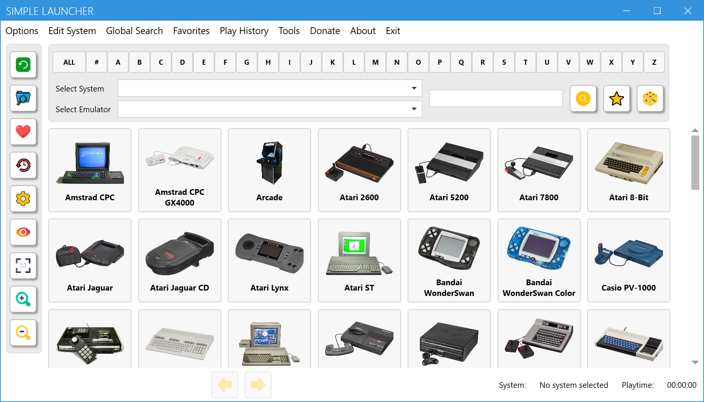

# Simple Launcher
Simple Launcher is an emulator frontend that makes playing retro games a breeze.

## Installation
You just need to download the application from the [release page](https://github.com/drpetersonfernandes/SimpleLauncher/releases), then extract the zip file into your chosen folder.

## Usage
* Click on the 'Edit System' menu item.
* Configure each system you wish. You can add, edit, or delete systems.
* Create a folder inside the images folder with the same name of the system you just created.
* Place all your cover images for that specific system inside that folder.
* Now, select the system from the dropdown menu on top of the app.
* Choose the emulator you wish to use.
* Click on the top button of the application.
* Click on the game you wish to launch.
  
Please note: You also have the option to use a custom System Image Folder, which can be set using the 'Edit System' menu.

## Where to Find Game Covers:
We do NOT provide ROMs, ISOs or Game Covers. 
You can find cover images on websites such as [Libretro Thumbnails](https://github.com/libretro-thumbnails/libretro-thumbnails) or [EmuMovies](https://emumovies.com). However, keep in mind that these sites are not affiliated with Simple Launcher.

## List of Parameters for Emulators
You can find a list of parameters gathered by us for each emulator [here](https://github.com/drpetersonfernandes/SimpleLauncher/wiki/parameters). 
Some specific cases, like adding LaserDisk, Windows Games, Sony Playstation 3, Sega Model 3 and ScummVM Games into the frontend, require special settings. Click [here](https://github.com/drpetersonfernandes/SimpleLauncher/wiki#special-settings) for more details.

## Wiki:
For more detailed explanations of how the frontend works, visit our [Wiki](https://github.com/drpetersonfernandes/SimpleLauncher/wiki).

## Additional Features:
- **Edit Systems menu:** Easily edit, add, or delete a system using this function.
- **Edit Links menu:** Customize the Video and Info search engine used within the UI.
- **Control Thumbnail Size:** Conveniently adjust the size of the cover images in the UI.
- **Update Notifications:** Be informed whenever a new version becomes available.
- **Error Logging:** The application includes an error logging mechanism that informs the developers of any errors that occur, thus enabling us to rectify bugs and enhance the program over time.

## Related Utilities:
- **[PS3BatchLauncherCreator](https://github.com/drpetersonfernandes/ps3batchlaunchercreator):** An application written by a Simple Launcher developer, that automatically creates BAT files for easy launch of PS3 games on the RPCS3 emulator.
- **[MAME Utility](https://github.com/drpetersonfernandes/MAMEUtility):** A utility for managing the MAME full driver information in XML format available on the [MAME](https://www.mamedev.org/release.html) website. It can generate multiple simplified (and smaller) XML subsets and also copy ROMs and image files based on the created XML.
- **[FindRomCover](https://github.com/drpetersonfernandes/FindRomCover):** An application that supports the organization of your cover image collection. It attempts to match the filename of image files with the ROM filenames. Users can choose the similarity algorithm to compare filenames.

## Technical Details:
The Simple Launcher is developed in C# using Windows Presentation Foundation (WPF) and Microsoft .NET 8 Framework. 
This program is Windows-only, with expected compatibility with Windows 7 and later versions. It has been tested on Windows 11.

## Support the Project:
Did you enjoy using the Simple Launcher frontend? Consider [donating](https://www.buymeacoffee.com/purelogiccode) to support the project or simply to express your gratitude!

## Contributors:
- **Peterson Fernandes** - [Github Profile](https://github.com/drpetersonfernandes)
- **RFSVIEIRA** - [Github Profile](https://github.com/RFSVIEIRA)