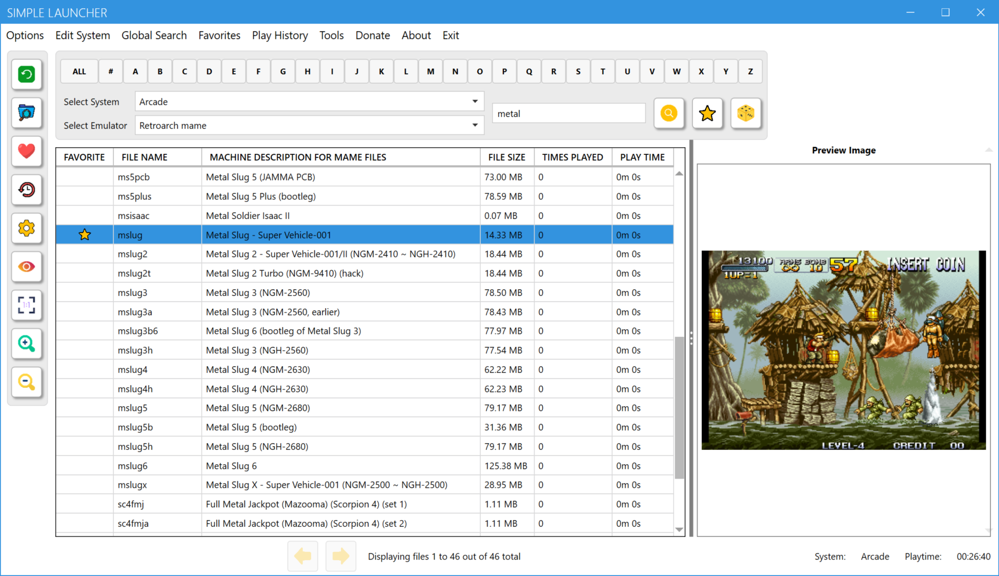

# Simple Launcher

Simple Launcher is a free program for Windows that lets you play games on emulators with ease.<br><br>


## How it Works:

- **Configuration:** The program searches for a file named "system.xml" in its folder, which contains all the settings for the system and emulators. You should edit this file to match your needs.

- **Game Selection:** When you select a system, the application opens the system directory and a list of emulators configured for that specific system. It then displays a grid of games located in the system folder. Each cell in the grid is clickable, and the app will launch the selected emulator with the chosen game.

- **Game Info:** Each grid cell displays a game cover, its name, a link to a YouTube video about the game, and an info link.

- **Game Covers:** The cover images should have the same filename as the game. They are loaded from a folder inside the "images" folder, which should have the same name as the system. The images must be in PNG, JPG, or JPEG format. If a cover is missing, a default image is used.<br><br>




## Where to Find Game Covers:

You can find cover images on websites such as [Libretro Thumbnails](https://github.com/libretro-thumbnails/libretro-thumbnails) or [EmuMovies](https://emumovies.com). However, please note that these sites are not affiliated with Simple Launcher.

## Configuration File ("system.xml"):

This file contains information about different systems and their settings. You can add as many systems and emulators as you wish. `You should manually configure this file to meet your needs.`

- **SystemName**: The name of the system.

- **SystemFolder**: The folder where the ROMs or games are located.

- **SystemIsMAME**: Indicates to the program whether the system is based on MAME. If true, the application will load the ROM descriptions alongside the ROM filenames.

- **FormatToSearch**: A list of file extensions that will be loaded from the SystemFolder. You can use as many as you want.

- **ExtractFileBeforeLaunch**: Should be true or false. If true, the launcher will extract the ZIP or 7Z file into a temporary folder before loading the extracted file.

- **FormatToLaunch**: If you extract the file to a temporary folder, you should specify here which extensions will be launched from the extracted folder.

- **EmulatorName**: The name of the emulator. You can add as many emulators as you want for each system.

- **EmulatorLocation**: The location of the emulator.

- **EmulatorParameters**: The parameters that are used for each emulator. Not all emulators require parameters.<br><br>

```xml
<SystemConfig>
	<SystemName>Atari 2600</SystemName>
	<SystemFolder>G:\OK\Atari 2600</SystemFolder>
	<SystemIsMAME>false</SystemIsMAME>
	<FileFormatsToSearch>
		<FormatToSearch>zip</FormatToSearch>
	</FileFormatsToSearch>
	<ExtractFileBeforeLaunch>false</ExtractFileBeforeLaunch>
	<FileFormatsToLaunch>
		<FormatToLaunch></FormatToLaunch>
	</FileFormatsToLaunch>
	<Emulators>
		<Emulator>
			<EmulatorName>Retroarch</EmulatorName>
			<EmulatorLocation>G:\Emulators\RetroArch\retroarch.exe</EmulatorLocation>
			<EmulatorParameters>-L "G:\Emulators\Retroarch\cores\stella_libretro.dll" -c "G:\Emulators\Retroarch\Config.cfg" -f</EmulatorParameters>
		</Emulator>
	</Emulators>
</SystemConfig>
```

## Additional Features:

- **Update Notifications:** You will be notified if a new version is available.

- **Error Logging:** The application also has an error logging mechanism that notifies the developers of any errors that occur. This way, we can fix bugs and improve the program over time.

## Special Settings:

**MAME Emulator**

When setting up the MAME emulator, you should set SystemIsMAME to true `<SystemIsMAME>true</SystemIsMAME>`. This way, the application will load the game description into the UI alongside the game filename.<br>
When setting the EmulatorParameters, you only need to specify the folder where your games are located: `<EmulatorParameters>-rompath "G:\OK\MAME\MAME Roms"</EmulatorParameters>`.<br>
You can also launch MAME Roms using the Retroarch emulator.<br>
Another method to launch MAME Roms is by using [RocketLauncher](https://www.rlauncher.com/). For this to work, [RocketLauncher](https://www.rlauncher.com/) needs to be configured to launch MAME Roms.

```xml
<SystemConfig>
	<SystemName>MAME</SystemName>
	<SystemFolder>G:\OK\MAME\MAME Roms</SystemFolder>
	<SystemIsMAME>true</SystemIsMAME>
	<FileFormatsToSearch>
		<FormatToSearch>zip</FormatToSearch>
	</FileFormatsToSearch>
	<ExtractFileBeforeLaunch>false</ExtractFileBeforeLaunch>
	<FileFormatsToLaunch>
		<FormatToLaunch></FormatToLaunch>
	</FileFormatsToLaunch>
	<Emulators>
		<Emulator>
			<EmulatorName>MAME</EmulatorName>
			<EmulatorLocation>G:\Emulators\MAME\mame.exe</EmulatorLocation>
			<EmulatorParameters>-rompath "G:\OK\MAME\MAME Roms"</EmulatorParameters>
		</Emulator>
		<Emulator>
			<EmulatorName>Retroarch</EmulatorName>
			<EmulatorLocation>G:\Emulators\RetroArch\retroarch.exe</EmulatorLocation>
			<EmulatorParameters>-L "G:\Emulators\Retroarch\cores\mame_libretro.dll" -c "G:\Emulators\Retroarch\Config.cfg" -f</EmulatorParameters>
		</Emulator>
		<Emulator>
			<EmulatorName>MAME through RocketLauncher</EmulatorName>
			<EmulatorLocation>G:\Emulators\RocketLauncher\RocketLauncher.exe</EmulatorLocation>
			<EmulatorParameters>"MAME"</EmulatorParameters>
		</Emulator>
	</Emulators>
</SystemConfig>
```

<br>

If you want to use MAME to launch Software List Roms (Legacy MESS Roms), you should include the name of the system in the EmulatorParameters like this: `<EmulatorParameters>gx4000 -cart</EmulatorParameters>`, as shown in the example below.<br>
For this to work, you need to follow the patterns found in the folder `.\MAME\hash\`. Inside this folder, you can find a list of XML files representing all the systems that MAME can emulate. Use the XML filename of the chosen system in the EmulatorParameters.<br><br>

```xml
<SystemConfig>
	<SystemName>Amstrad CPC GX4000</SystemName>
	<SystemFolder>G:\OK\Amstrad CPC GX4000</SystemFolder>
	<SystemIsMAME>false</SystemIsMAME>
	<FileFormatsToSearch>
		<FormatToSearch>zip</FormatToSearch>
	</FileFormatsToSearch>
	<ExtractFileBeforeLaunch>false</ExtractFileBeforeLaunch>
	<FileFormatsToLaunch>
		<FormatToLaunch></FormatToLaunch>
	</FileFormatsToLaunch>
	<Emulators>
		<Emulator>
			<EmulatorName>MAME gx4000</EmulatorName>
			<EmulatorLocation>G:\Emulators\MAME\mame.exe</EmulatorLocation>
			<EmulatorParameters>gx4000 -cart</EmulatorParameters>
		</Emulator>
	</Emulators>
</SystemConfig>
```

<br>

**Microsoft Windows Games or Applications**

If you want to add your Windows Games or Applications to the Simple Launcher frontend, you should create a folder with Shortcut (lnk), BAT (bat) or Executable (exe) files that call the Game or Application. When configuring this system in "system.xml," you should set `<FormatToSearch>lnk</FormatToSearch>` or `<FormatToSearch>bat</FormatToSearch>` or `<FormatToSearch>exe</FormatToSearch>` as shown below.<br>
If you prefer to use BAT (bat) files to call your games use the model below as an example.<br>

```bat
@echo off
cd /d "J:\Microsoft Windows\Mega Man 11"
start game.exe
```
<br>

```xml
<SystemConfig>
	<SystemName>Microsoft Windows</SystemName>
	<SystemFolder>G:\Microsoft Windows</SystemFolder>
	<SystemIsMAME>false</SystemIsMAME>
	<FileFormatsToSearch>
		<FormatToSearch>lnk</FormatToSearch>
		<FormatToSearch>bat</FormatToSearch>
		<FormatToSearch>exe</FormatToSearch>
	</FileFormatsToSearch>
	<ExtractFileBeforeLaunch>false</ExtractFileBeforeLaunch>
	<FileFormatsToLaunch>
		<FormatToLaunch></FormatToLaunch>
	</FileFormatsToLaunch>
	<Emulators>
		<Emulator>
			<EmulatorName>No Emulator</EmulatorName>
			<EmulatorLocation></EmulatorLocation>
			<EmulatorParameters></EmulatorParameters>
		</Emulator>
	</Emulators>
</SystemConfig>
```

<br>

**RPCS3 Emulator**

This emulator loads games extracted from ISO files into a folder. To launch a specific game, it searches for a file named EBOOT.BIN located inside the `PS3_GAME\USRDIR\` or `USRDIR\` directories. Configuring these games in an emulator frontend can be challenging. The quickest and easiest solution we found was to create BAT files that can launch the games with ease. These BAT files can then be configured in Simple Launcher to be treated as games. When configuring this system in "system.xml," you should set `<FormatToSearch>bat</FormatToSearch>` as shown below. We have created a utility that can generate these BAT files for you. Please see the section "Related Utilities" for more information.<br><br>

```xml
<SystemConfig>
	<SystemName>Sony Playstation 3</SystemName>
	<SystemFolder>J:\Sony PS3 Roms</SystemFolder>
	<SystemIsMAME>false</SystemIsMAME>
	<FileFormatsToSearch>
		<FormatToSearch>bat</FormatToSearch>
	</FileFormatsToSearch>
	<ExtractFileBeforeLaunch>false</ExtractFileBeforeLaunch>
	<FileFormatsToLaunch>
		<FormatToLaunch></FormatToLaunch>
	</FileFormatsToLaunch>
	<Emulators>
		<Emulator>
			<EmulatorName>RPCS3</EmulatorName>
			<EmulatorLocation></EmulatorLocation>
			<EmulatorParameters></EmulatorParameters>
		</Emulator>
	</Emulators>
</SystemConfig>
```

## Related Utilities:

- **[PS3BatchLauncherCreator](https://github.com/drpetersonfernandes/ps3batchlaunchercreator):** A program that automatically creates BAT files to easily launch PS3 games on the RPCS3 emulator. Written by a Simple Launcher developer.

- **MAMEListCreator:** A program that creates a simplified XML of the MAME games. You need the MAME full driver information in XML format, available on the [MAME](https://www.mamedev.org/release.php)  website. It will generate multiple simplified (and smaller) XML databases. One of these databases will contain all the MAME games (called mame.xml), which is used in the Simple Launcher application to load game descriptions of MAME games. It will also create multiple other databases for each driver emulated by MAME. Written by a Simple Launcher developer. - I'M WORKING TO PUBLISH IT ON GITHUB.

- **[FindRomCover](https://github.com/drpetersonfernandes/FindRomCover):** A program that helps you organize your cover image collection. It attempts to match the filename of image files with the filename of the ROMs. It uses [The Levenshtein Algorithm](https://en.wikipedia.org/wiki/Levenshtein_distance), created by Soviet mathematician Vladimir Levenshtein, to compare filenames of files. Written by a Simple Launcher developer.

- **ScrapingRomCover:** A program that scrapes the web searching for cover images of games. It uses the Google Image Search API or the Bing Image Search API (which is preferred). You will need to provide your own KEY to access Bing or Google APIs; charges may apply. Written by a Simple Launcher developer. - I'M WORKING TO PUBLISH IT ON GITHUB.

## Technical Details:

Simple Launcher is written in C# using Microsoft Visual Studio Community 2022 (64-bit) and the Windows Presentation Foundation (WPF) Framework with Microsoft .NET 8.0.<br>
This program is Windows-only. Compatibility with Windows 7 and later versions is expected. It has been tested on Windows 11.

## Support the Project:

Did you enjoy using the Simple Launcher frontend? Consider [donating](https://www.buymeacoffee.com/purelogiccode) to support the project or simply to say thanks!

## Contributors:

- **Peterson Fernandes** - [Github Profile](https://github.com/drpetersonfernandes)
- **RFSVIEIRA** - [Github Profile](https://github.com/RFSVIEIRA)
