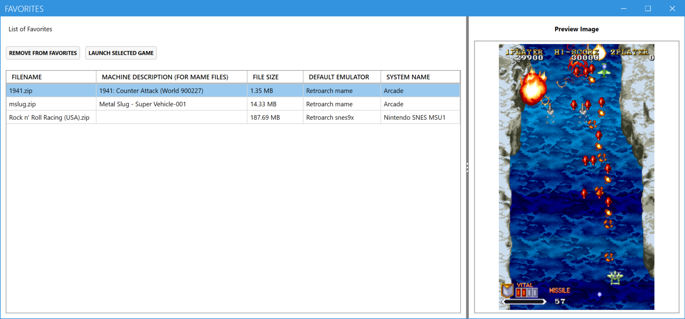

# Simple Launcher
Simple Launcher is an emulator frontend that makes playing retro games a breeze.

Main Window in Grid View With Right Button Context Menu

Main Window in List View With Right Button Context Menu

Global Search Window

Favorites Window

Edit System Window in Expert Mode

If you like the software, please give us a Star. 
That will be useful to advertise 'Simple Launcher'.

## Installation
You need to download the application from the [release page](https://github.com/drpetersonfernandes/SimpleLauncher/releases), then extract the zip file into your chosen folder.

## Basic Usage
* Click on the 'Edit System' menu item.
* Click on the 'Easy Mode' menu item.
* Follow the steps to install a System.
* Add ROM files for that system in the indicated folder.
* Add cover images for that system in the indicated folder.
* Go back to the Main Window.
* Select the added system from the dropdown menu.
* Click on the All Button to show all games for that system.
* Click on the game you wish to launch.

## Where to Find ROMs or ISOs:
We do NOT provide ROMs or ISOs.

## Where to Find Game Covers Images:
We provide Image Pack for some systems. 
If the Image Pack is not provided, you can download cover images on websites like [Libretro Thumbnails](https://github.com/libretro-thumbnails/libretro-thumbnails) or [EmuMovies](https://emumovies.com).

## Advanced Usage
'Simple launcher' also offers Expert Mode for advanced users.
In this mode user can manually Add, Edit or Delete Systems into the frontend.
Users will be able to custom folders, add multiple emulators for the same System and add custom parameters.  
You can find more details in our [Wiki](https://github.com/drpetersonfernandes/SimpleLauncher/wiki).

## Additional Features:
- **Edit Systems:** Easily edit, add, or delete a system.
- **Automatic installation of most emulators:** We offer automatic installation of emulators that don't require BIOS or copyrighted files to work.
- **Search Engine:** User can search for games from within the frontend.
- **Right Click Context Menu:** User can load Cover image, Title snapshot, Gameplay snapshot, Manual, Walkthrough, Cabinet, Flyer or PCB of the selected game. 
- **Edit Links:** Customize the Video and Info search engine used within the UI.
- **Control Thumbnail Size:** Conveniently adjust the size of the cover images in the UI.
- **Automatic Update:** The application has an automatic update mechanism.

## Related Utilities:
- **[MAME Utility](https://github.com/drpetersonfernandes/MAMEUtility):** A utility for managing the MAME full driver information in XML format available on the [MAME](https://www.mamedev.org/release.html) website. It can generate multiple simplified (and smaller) XML subsets and also copy ROMs and image files based on the created XML.
- **[FindRomCover](https://github.com/drpetersonfernandes/FindRomCover):** An application that supports the organization of your cover image collection. It attempts to match the filename of image files with the ROM filenames. Users can choose the similarity algorithm to compare filenames.

## Technical Details:
Simple Launcher is developed in C# using Windows Presentation Foundation (WPF) and Microsoft .NET Core 9 Framework. 
This program is Windows-only.
It has been tested on Windows 11.

## Support the Project:
Did you enjoy using the Simple Launcher frontend?
Consider [donating](https://purelogiccode.com/donate) to support the project or simply to express your gratitude!

## Contributors:
- **Peterson Fernandes** - [Github Profile](https://github.com/drpetersonfernandes)
- **RFSVIEIRA** - [Github Profile](https://github.com/RFSVIEIRA)