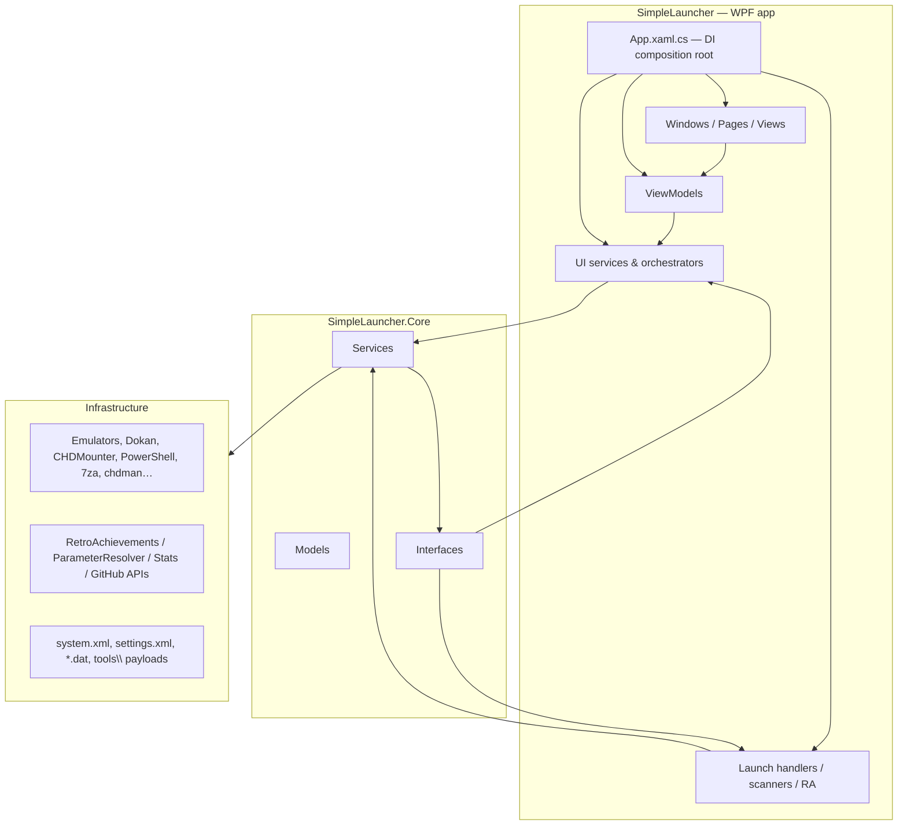

# 04 — Architecture

> Layers, dependency injection, startup/shutdown lifecycle, host-interface pattern, MVVM.
> Related: [02 — Projects & Solution](02-projects-and-solution.md) · [05 — Configuration](05-configuration.md)

## Layer overview



The rule of thumb: **Core knows nothing about WPF windows** — it exposes services and interfaces; the app implements host interfaces and binds them via `Initialize(host)`.

## Dependency injection

- **Composition root:** `SimpleLauncher\App.xaml.cs`. Config is built first (`ConfigurationBuilder().AddJsonFile("appsettings.json")`, `App.xaml.cs:108-112`), then ~200 registrations, then `BuildServiceProvider(ValidateOnBuild = true)` (`App.xaml.cs:491`).
- **Access pattern:** `App.ServiceProvider` is a public static `IServiceProvider` (`App.xaml.cs:89`); windows/VMs resolve on demand with `App.ServiceProvider.GetRequiredService<T>()` (e.g. `MainWindow.xaml.cs:319`, `EasyModeWindow` at `MainWindow.xaml.cs:416`).

### Registration groups (summary, all in `App.xaml.cs`)

| Group | Lines | Examples |
|---|---|---|
| HTTP clients (named, via `AddHttpClient`) | 141–201 | `LogErrorsClient`, `StatsClient`, `UpdateCheckerClient`, `SupportWindowClient`, `RetroAchievementsClient` (30 s), `GameImageClient` (20 s), `EasyModeClient`, `GameClassificationClient` (30 s), `ParameterResolverClient` (60 s), `DownloadClient` (Polly: 5 retries, 5-min handler lifetime) |
| Managers & infrastructure (singleton) | 204–259 | `IConfiguration`, `IMemoryCache`, Serilog `ILogger`, `ICredentialProtector→WindowsCredentialProtector`, `SettingsManagerService` (factory + `Load()`), `CheckForUpdatesService`, `QuitSimpleLauncher`, `ReinstallSimpleLauncher`, `GameLauncherService`, `IExtractionService`, mount services, `FavoritesManager`/`PlayHistoryManager`/`RetroAchievementsManager` (factories) |
| Game platform scanners (singleton) | 261–274 | 11 × `IGamePlatformScanner` + `GameScannerService` + `ISteamVdfParser`, `IIconExtractor` |
| UI services (singleton) | 275–303 | `ThemeMenuService`, `LanguageMenuService`, `LoadingOverlayService`, `StartupInitializationService`, `GameListUiService`, `GameFileWatcherService`, `MenuActionHandlerService`, `IUpdateStatusBar`, `IMenuCheckMarkService`, `IUiResetService`, `IFindCoverImageService`, `IImageLoader→WpfImageLoader`… |
| WPF platform + orchestrators (singleton) | 306–356 | `IMessageDialogService`, `IResourceProvider`, `IDispatcherService`, `IFilePickerService`, `IApplicationLifetime`, `IMessageBoxLibraryService`, `IParameterResolverService`, `IUiOrchestrator`, `IGameItemRenderService`, `IRetroAchievementsHasherTool`, `ISystemSelectionOrchestrator`, `IGameFileLoadingOrchestrator`, `IDiscConverter`, `IAudioInputService`, `IApplicationLifecycleService`, `IMenuOrchestrator`, `IGameBrowserService`, hotkey + screenshot services |
| Emulator config handlers (singleton) | 445–465 | 21 × `IEmulatorConfigHandler` (Ares…Yumir) |
| Launch strategies (singleton) | 468–475 | 8 × `ILaunchStrategy` (Default, DOSBox, CommanderGenius, ChdToCue, ChdMount, PbpToCue, XisoMount, ZipMount) |
| Transient | 229, 359–397, 400–442 | `DownloadManager`; 44 ViewModels (incl. 21 `Inject*ConfigViewModel`); 43 windows (incl. `MainWindow`, `EasyModeWindow`, 21 `Inject*ConfigWindow`) |

### Host-interface pattern

Plain services are **not** given a window reference in the constructor. Instead:

```csharp
service.Initialize(host);   // host = the MainWindow (or an orchestrator) implementing the host interface
```

Examples (all interfaces in `SimpleLauncher\Interfaces\`):

| Interface | Implemented by | Consumed by |
|---|---|---|
| `IUiOrchestratorHost` | MainWindow | `UiOrchestratorService` (which also implements `ILoadingOverlayHost`/`IGameListUiHost` proxies) |
| `IMenuCheckMarkHost` | MainWindow (partial `MenuCheckMarkHost.cs`) | `MenuCheckMarkService` |
| `IUiResetHost` | MainWindow | `UiResetService` |
| `IStatusBarHost` | MainWindow | `UpdateStatusBarService` |
| `IStartupInitializationHost` | MainWindow | `StartupInitializationService` |
| `IThemeMenuHost` / `ILanguageMenuHost` | MainWindow | `ThemeMenuService` / `LanguageMenuService` |
| `IGameFileLoadingHost`, `IGameItemRenderHost`, `ISystemSelectionHost`, `IMenuActionHost`, `IMenuOrchestratorHost` | MainWindow partials | loading/render/system-selection/menu orchestrators |
| `IWindowContext` | `WpfWindowContext` (ad-hoc via `WpfWindowContext.FromMainWindow(window)`, not DI-registered) | `GameLauncherService` |

`MainWindow` implements 10 host interfaces and is wired in its constructor (`MainWindow.xaml.cs:252-256`): `UiOrchestratorService.Initialize(this)`, `_gameBrowser.Initialize(this, this, this)`, `_menuOrchestrator.Initialize(...)`, `UiResetService.Initialize(this)`, `UpdateStatusBarService.Initialize(this)`.

## Startup sequence (`App.OnStartup`, `App.xaml.cs:102-669`)

```mermaid
sequenceDiagram
    participant App as App.OnStartup
    participant SP as ServiceProvider
    participant MW as MainWindow
    App->>App: Global exception handlers, -debug arg
    App->>App: Build config (appsettings.json)
    App->>App: Serilog bootstrap (file sink + DebugWindowSink + BugReportApiSink)
    App->>App: Register DI (ValidateOnBuild)
    App->>App: Temp-folder check → abort if running from %TEMP%
    App->>SP: BuildServiceProvider
    App->>App: Fire-and-forget CleanupTrash + CleanupTempFiles
    App->>App: Single-instance Mutex + EventWaitHandle (skipped with --restarting)
    App->>App: ApplyTheme + ApplyLanguage from settings
    App->>MW: new MainWindow() via DI → Show()
    App->>App: -debug → DebugWindow; -whatsnew → UpdateHistoryWindow
    App->>App: Fire-and-forget usage stats
    MW->>MW: OnLoadedAsync → StartupInitializationService.InitializeAsync + HandleLoadedAsync
```

`StartupInitializationService.InitializeAsync` (`Services\StartupInitialization\StartupInitializationService.cs:59-72`) order:
1. Status-bar timer (`StatusBarTimeoutSeconds`, default 3 s) — `:74-88`
2. Theme/language menu state — `:90-98`
3. UI initial state ("No system selected", view mode) — `:100-109`
4. **Write-access check** on base dir → `MoveToWritableFolderMessageBoxAsync` — `:111-118`
5. Pagination defaults — `:120-124`
6. **Tray icon** — `:126-137`
7. **Required-files check** (`CheckForRequiredFilesService`) — `:139-150`
8. Overlay-button checkmarks — `:152-158`
9. **Gamepad controller** start/stop per settings — `:160-175`

`HandleLoadedAsync` (`MainWindow.xaml.cs:350-430`):
1. `DisplaySystemSelectionScreenAsync` — `:354`
2. **Silent update check** (GitHub `releases/latest`, `CheckForUpdatesService.cs:89-143`) — `:368`
3. Usage stats call — `:370`
4. **First-run flow** (`:381-424`): if `system.xml` has no systems → loading overlay "Scanning for Windows games..." → all 11 store scanners run in parallel (`GameScannerService.cs:77-97`) → if still empty → `FirstRunWelcomeMessageBoxAsync` → **EasyModeWindow** wizard → reload system list.

## Shutdown & close lifecycle

- `MainWindow_Closing` (`MainWindow.CloseWindowEvents.cs:14-45`): defers close until settings are saved; unsubscribes events; disposes watchers/hotkey/tray/CHD mounter.
- **Minimize-to-tray** hides the window (`:49`); tray menu provides Open / Minimize to Tray / Debug Window / Exit.
- `QuitSimpleLauncher` / `ReinstallSimpleLauncher` handle restart/update/reinstall (see [16 — Updater](16-updater.md)).

## MVVM

- **CommunityToolkit.Mvvm 8.4.2**: ViewModels derive from `ObservableObject`, commands from `[RelayCommand]` (source generators) — e.g. `SystemSelectionViewModel`.
- 44 ViewModels registered transient; windows resolve them and set `DataContext`.
- `IWindowContext` decouples the launcher from `MainWindow` (`Services\WpfServices\WpfWindowContext.cs:10`).

## Related docs

- [02 — Projects & Solution](02-projects-and-solution.md)
- [05 — Configuration](05-configuration.md)
- [07 — Core Services](07-core-services.md)
- [08 — UI Layer](08-ui-layer.md)
