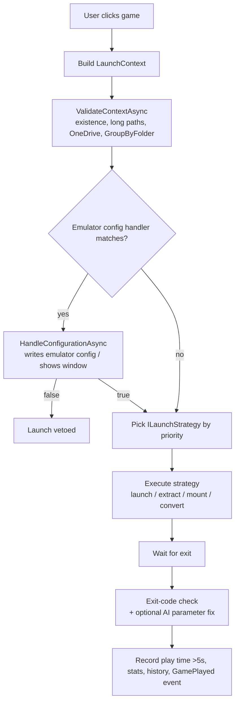

# 06 — Systems & Launch

> System model, the game-launch pipeline, launch strategies, emulator config handlers, AI parameter resolution.
> Related: [05 — Configuration](05-configuration.md) · [07 — Core Services](07-core-services.md) · [18 — Emulator Parameters](18-emulator-parameters.md)

## System model

A "system" = `ISystemManager` (see [05 — Configuration](05-configuration.md#systemxml)): name, one or more ROM folders, image folder, file formats to search/launch, extract-before-launch flag, group-by-folder flag, and 1–5 emulator configurations.

- Loaded from `system.xml` by `SystemManagerService` (via `SystemConfigurationService` in the app).
- Validated by `DisplaySystemInformation` (bad paths shown red + error dialog) and `EditSystemWindow.SaveSystem` (name/character/path validation, relative-path rewriting to `%BASEFOLDER%`, GroupByFolder restricted to MAME/DOSBox).

## Launch pipeline (`GameLauncherService`)

`SimpleLauncher\Services\GameLauncher\GameLauncherService.cs`

Key points (with citations):

- Entry point `HandleButtonClickAsync` (`:92`); guards: no system (`:117`), no emulators (`:126`), emulator lookup by name (`:136`).
- `ValidateContextAsync` (`:145`, impl `:212`): file/dir existence incl. long paths (`:225-231`), Unicode-normalization fallback (`:237-247`), **OneDrive-specific guidance** (`:254-270`), GroupByFolder restricted to MAME/DOSBox (`:309-326`).
- **Config-handler interception** (`:154-158`): first matching `IEmulatorConfigHandler` runs; returning `false` **vetoes the launch**.
- **Strategy selection** (`:170`): `_launchStrategies.FirstOrDefault(s => s.IsMatch(context))` ordered by `Priority` (`:67`).
- Finally (`:184-192`): resume gamepad, record play time (>5 s), update stats/history, raise `GamePlayed`.

### Regular emulator launch (`LaunchRegularEmulatorAsync`, `:826`)

- Per-emulator quirks (`:875-906`); archive extraction for Azahar/Citra/DuckStation/Ootake/Sameboy/`ExtractFileBeforeLaunch` (`:935-965`); RetroArch `-L` and Xemu `-dvd_path` parameter validation (`:913-933`).
- Path resolution: emulator exe (`:1026-1038`), emulator folder (`:1041-1053`), containing system folder (`:1056`), ROM name (`:1060`), `ResolveParameterString` (`:1063-1070`).
- **Auto-append ROM** unless `%ROM%`/`%NAME%`/game placeholder present; MAME/Raine get the bare machine name (`:1080-1104`).
- `ProcessStartInfo` with redirected UTF-8 stdout/stderr (`:1121-1132`), waits for exit (`:1180`).

### Exit-code reporting (`CheckForExitCodeWithErrorAnyAsync`, `:1317`)

- Ignored: exit 0, `MemoryAccessViolation` (-1073741819), `DepViolation` (-1073740791) (`:1329`), RetroArch "File open/read error" (`:1335-1339`).
- RetroArch mkdir/permission (`:1342-1360`) and parameter issues (`:1363-1378`).
- MAME: ROM-set/unknown system/load-image/INI corruption (`:1381-1466`, incl. `MameConfigurationService.RestoreMameIniFromSample` at `:1455`).
- Generic failure → `CouldNotLaunchGameMessageBox` + **`AskAiToFixParameters`** (`:1472-1478`).
- `DoNotCheckErrorsOnSpecificEmulators` (`:1522-1550`): skips Kega Fusion, Project64, Emulicious, Speccy, ProSystem, fMSX (config `EmulatorsToSkipErrorChecking`).

### Elevation & AppLocker detection

`CheckApplicationControlPolicyService` (Core, `:15-51`): Win32 error classification —

| NativeErrorCode | Meaning | UI |
|---|---|---|
| 5 + AppLocker/WDAC message | Blocked by policy | `ApplicationControlPolicyBlockedMessageBoxAsync` |
| 740 | Requires elevation | `ElevationRequiredMessageBoxAsync` |
| 1223 | User canceled UAC | silent |

Used in batch/shortcut/exe/emulator launch paths (`:471-483`, `:622-632`, `:753-765`, `:1210-1223`).

## Launch strategies (8)

Ordered by `Priority`; first `IsMatch` wins:

| Strategy | Priority | Applies to | Behavior |
|---|---|---|---|
| `DefaultLaunchStrategy` | 999 | everything else | `.BAT` → batch, `.LNK/.URL` → shortcut, `.EXE` → executable, else regular emulator launch |
| `ZipMountStrategy` | 30 | `.zip/.7z/.rar` + RPCS3 / ScummVM / XBLA | mount archive; load `EBOOT.BIN`, ScummVM auto-detect, or XBLA nested exe |
| `DosBoxLaunchStrategy` | 25 | DOSBox-family emulator + directory/archive/ISO/CHD | ISO/CHD mount, archive extract, `.conf/.bat/.exe/.com` detection or `DosBoxFileSelectionWindow`, temp conf, `-conf` append |
| `ChdToCueStrategy` | 25 | `.chd` + 4DO / Raine | `ConvertChdToCueBinAsync` → launch `.cue` → delete temp |
| `XisoMountStrategy` | 20 | Cxbx + `.iso` | mount XISO → launch mounted `default.xbe` |
| `CommanderGeniusLaunchStrategy` | 20 | Commander Genius + archive | resolve CG data path, extract to `games\<zipname>`, `dir="games/<zipname>"` |
| `PbpToCueStrategy` | 15 | `.pbp` + Mednafen | `ConvertPbpToCueBinAsync` → launch `.cue` → clean temp incl. `_disc1` |
| `ChdMountStrategy` | 10 | `.chd` (not RetroArch/DOSBox) + 19-emulator list | mount via CHDMounter, find launch file per emulator (EBOOT.BIN/default.xex/image.iso/default.xbe/`.bin`/`.cue`), regular launch |

## Extraction (`ExtractionService`)

`SimpleLauncher.Core\Services\ExtractFiles\ExtractionService.cs`

- `ExtractToTempAndGetLaunchFileAsync` (`:41`), `ExtractToFolderAsync` (`:70`); only 7z/zip/rar (`:126`); **file-lock retry 10×1 s** (`:100-123`).
- **`.extraction_in_progress` marker** written before extract (`:152-153`), removed on success (`:253-256`, `:270-274`), triggers `CleanupPartialExtractionAsync` on failure (`:286-290`).
- **Disk-space check:** estimated size × 1.2 vs `DriveInfo.AvailableFreeSpace` → `DiskSpaceErrorMessageBoxAsync` + IOException (`:165-196`).
- **Path-traversal guard:** every entry must resolve under the destination root (`:199-219`, `:364-382`); random temp names (`:351-354`).
- **7za fallback:** SharpCompress failure on `.7z` → `tools\SevenZip\7za.exe`/`_arm64.exe` (`:446-448`), args `x -o"dest" -y "archive"` (`:460`), **30-minute timeout** with kill (`:485-503`).
- Temp root: `%TEMP%\SimpleLauncher` (`:20`); `ValidateAndFindGameFileAsync` (`:540`) searches `FileFormatsToLaunch` then any file.

## Mounting (Core `GameLauncher\MountFiles\`)

| Service | Backend | Details |
|---|---|---|
| `MountChdFiles` / `MountChdDrive` | `tools\CHDMounter\CHDMounter.exe` (+`_arm64`) | Dokan check first (`DokanValidation.IsDokanInstalled()`); args `/a "<chd>" /s:<consoleIndex>`; CHDMounter auto-picks drive; mount poll 240×500 ms (120 s max, `:724-773`); console index per system/emulator (`:567-718`); unmount = kill + 20 s wait (`:300-317`); `DisposeAsync` verifies release (`MountChdDrive:117-129`) |
| `MountIsoFiles` | PowerShell `Mount-DiskImage` | drive letter from `Get-Volume` output (`:193-258`); 30 s PS timeout (`:225`); polls 10 s for mount (`:74`); finds `EBOOT.BIN` (`:95`); dismount in finally (`:317-342`); execution-policy detection (`:412+`) |
| `MountXisoFiles` / `MountXisoDrive` | `tools\SimpleXisoDrive\SimpleXisoDrive.exe` (+`_arm64`) | Dokan validation (`:80-87`); **drive letter Z→D** selection (`:33-57`); args `"<iso>" "Z:"`; polls for `default.xbe` 240×500 ms (`:172-209`); kill + 20 s wait on dispose (`:67`, `:91`) |
| `DokanValidation` | P/Invoke `dokan2.dll` | `DokanVersion() > 0` (`:12-36`) |

## Conversions (`DiscConverter`)

`SimpleLauncher.Core\Services\Converters\DiscConverter.cs` — all with **5-minute timeout** + kill, temp files in `%TEMP%\SimpleLauncher`:

| Method | Tool | Args |
|---|---|---|
| `ConvertChdToIsoAsync` (`:31`) | `tools\BatchConvertToCHD\chdman.exe` (+arm64) | `extractdvd -i -o` |
| `ConvertChdToCueBinAsync` (`:121`) | chdman | `extractcd -i -o` |
| `ConvertPbpToCueBinAsync` (`:211`) | `tools\PSXPackager\psxpackager.exe` (x64 only) | `-i -o -d 1`; handles `_disc1` |
| `ConvertToIsoAsync` (`:317`) | `tools\BatchConvertToRVZ\DolphinTool.exe` (+arm64) | `convert --format=iso --input --output` |

## Emulator config handlers (21) & Core configuration services

**Interface:** `IEmulatorConfigHandler.IsMatch(name, path)` + `Task<bool> HandleConfigurationAsync(context)` (`IEmulatorConfigHandler.cs:16-23`); `false` vetoes launch (`GameLauncherService.cs:157`).

**Pattern:** if `ShowSettingsBeforeLaunch` → modal `Inject*ConfigWindow` (user "Run" vs "Cancel"); else `XxxConfigurationService.InjectSettings(...)`.

| Handler (app) | Core service | Config file written |
|---|---|---|
| AresConfigHandler | AresConfigurationService | `settings.bml` |
| AzaharConfigHandler (catch `AzaharPermissionException` → msg, still launch) | AzaharConfigurationService | `qt-config.ini` |
| BlastemConfigHandler | BlastemConfigurationService | `default.cfg` |
| CemuConfigHandler | CemuConfigurationService | `settings.xml` |
| DaphneConfigHandler (no file — appends CLI args) | DaphneConfigurationService | none (`BuildArguments`) |
| DolphinConfigHandler | DolphinConfigurationService | `Dolphin.ini` (portable `User\Config\` else `%APPDATA%\Dolphin Emulator\Config`) |
| DuckStationConfigHandler | DuckStationConfigurationService | `settings.ini` |
| FlycastConfigHandler | FlycastConfigurationService | `emu.cfg` |
| MameConfigHandler (catch IO/Unauthorized → msg, still launch) | MameConfigurationService | `mame.ini` |
| MednafenConfigHandler | MednafenConfigurationService | `mednafen.cfg` |
| MesenConfigHandler | MesenConfigurationService | `settings.json` |
| Pcsx2ConfigHandler (catch `Pcsx2PermissionException` → msg, still launch) | PCSX2ConfigurationService | `PCSX2.ini` (portable `inis\`, emu dir, or `Documents\PCSX2\inis`) |
| RaineConfigHandler | RaineConfigurationService | `config\raine32_sdl.cfg` |
| RedreamConfigHandler | RedreamConfigurationService | `redream.cfg` |
| RetroArchConfigHandler | RetroArchConfigurationService | `retroarch.cfg` |
| Rpcs3ConfigHandler | RPCS3ConfigurationService | `config.yml` (YAML) |
| SegaModel2ConfigHandler | SegaModel2ConfigurationService | `EMULATOR.INI` |
| StellaConfigHandler | StellaConfigurationService | `stella.sqlite3` (SQLite upserts; sample DB copied if missing) |
| SupermodelConfigHandler | SupermodelConfigurationService | `Config\Supermodel.ini` |
| XeniaConfigHandler (swallows all exceptions) | XeniaConfigurationService | `xenia-canary.config.toml` + `xenia.config.toml` (or `Documents\Xenia\`) |
| YumirConfigHandler | YumirConfigurationService | `Ymir.toml` |

All services restore missing config files from `samples\{Emulator}\{file}` and produce the per-field settings consumed by the 21 `Inject*ConfigViewModel`s (settings persisted in `settings.xml` under `EmulatorSettings\{Emulator}`).

## AI parameter resolution

- **`ParameterResolverService`** (Core, `Services\ParameterResolver\ParameterResolverService.cs`): POST to relative `api/ParameterResolver/resolve` on the `ParameterResolverClient` (base `Urls:ParameterResolverApi`, 60 s), header `X-Api-Key` (from `AppConstants.GetApiKey()`), camelCase JSON. Request: `ParameterResolverRequest` (system name/folder, formats, flags); response: `ParameterResolverResult` (`SuggestedParameter`, `Explanation`). Non-2xx → null + error log; malformed JSON → null (logged); network errors propagate.
- **`AskAiToFixParameters`** (app, `Services\GameLauncher\AskAiToFixParameters.cs`): after a failed launch, prompts the user, shows a loading overlay, calls the resolver, shows a suggestion dialog, and on accept saves the new `EmulatorParameters` and reloads the system.

## Related docs

- [05 — Configuration](05-configuration.md)
- [07 — Core Services](07-core-services.md)
- [11 — Bundled Tools](11-bundled-tools.md)
- [18 — Emulator Parameters](18-emulator-parameters.md)
