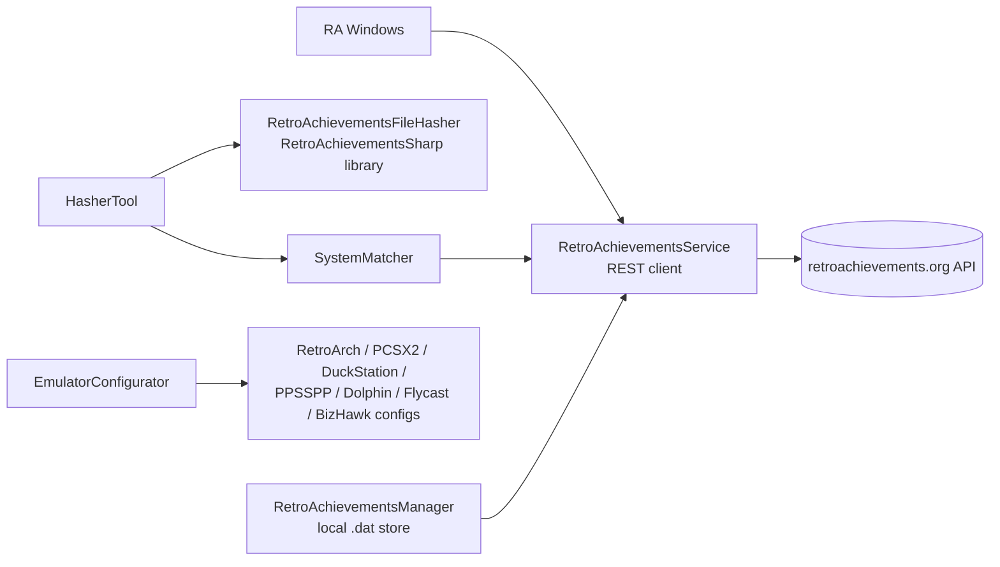

# 09 — RetroAchievements

> The RetroAchievements integration: API client, system matching, hashing, credential injection, UI.
> Related: [07 — Core Services](07-core-services.md) · [12 — Data Formats](12-data-formats.md)

## Overview

HTTP client: named `"RetroAchievementsClient"` via `IHttpClientFactory` (`RetroAchievementsService.cs:37`; registered `App.xaml.cs:145-149` — 30 s timeout, `User-Agent: SimpleLauncher/1.0`). Base URLs from config `Urls:RetroAchievementsApi/Request/Site` (defaults `https://retroachievements.org/API/…`). Auth: API key as `y=`, username as `u=` query params; every call throws `RaUnauthorizedException` on HTTP 401.

## API client (`RetroAchievementsService`, app project)

| Method | Endpoint | Returns |
|---|---|---|
| `GetSessionTokenAsync(user, pass)` | POST `dorequest.php` (`r=login`) | session token |
| `GetGameInfoAndUserProgressAsync(gameId, user, key)` | `API_GetGameInfoAndUserProgress.php` | `RaUserGameProgress` + `RaAchievement[]` (incl. hardcore points) |
| `GetGameExtendedAsync(gameId, user, key)` | `API_GetGameExtended.php` | `RaGameExtendedDetails` |
| `GetUserGameRankAndScoreAsync(...)` | `API_GetUserGameRankAndScore.php` | `List<RaUserGameRank>` |
| `GetGameRankAndScoreAsync(..., latestMasters)` | `API_GetGameRankAndScore.php` (`t=1|0`) | `List<RaGameRankAndScore>` |
| `GetUserProfileAsync(user, key)` | `API_GetUserProfile.php` | `RaProfile` |
| `GetUserRecentlyPlayedGamesAsync(..., count, offset)` | `API_GetUserRecentlyPlayedGames.php` | recently played |
| `GetAchievementsEarnedBetweenAsync(..., from, to)` | `API_GetAchievementsEarnedBetween.php` (epoch `f/t`) | `List<RaEarnedAchievement>` |
| `GetUserCompletionProgressAsync(..., count=100, offset=0)` | `API_GetUserCompletionProgress.php` | paginated completion list (site URL prefixed onto `ImageIcon`) |

## System matching (`RetroAchievementsSystemMatcher`, Core)

- `SystemMappings`: static dictionary official RA system name → `RaSystemInfo { Id, Aliases[] }` — ~80 systems, plus `"unsupported"` (ID 102) with a huge alias list (PS3/PS4/Xbox/Switch/Windows…) (`:27-186`).
- `GetBestMatchSystemName` (`:193-217`): lowercase/trim, exact scan over all aliases; unmatched logged once per name.
- `GetExactAliasMatch` (`:256-271`), `IsSystemInMappings` (`:279-305`, contains/substring), `GetSupportedSystemNames` (`:233-236`), `GetSystemId` (`:243-249`, −1 if unknown).

## Hashing (`RetroAchievementsHasherTool` + `RetroAchievementsFileHasher`, Core)

All hash computation is delegated to the **RetroAchievementsSharp** NuGet library
(`RcHash.GenerateFromFile`) — a native C# port of the rcheevos hashing engine that
produces the exact same hashes as the RAHasher binary it replaces (the binary and the
custom MD5 logic are gone). The system matcher resolves the system name to its official
RA console ID, and the library handles every console's algorithm internally (whole-file
MD5, header stripping, N64 byte-swapping, arcade filename hashing, Arduboy line-ending
normalization, disc hashing, …).

| Concern | Implementation |
|---|---|
| Console dispatch | `RetroAchievementsSystemMatcher.GetSystemId` → `RcHash.GenerateFromFile(hash, (uint)systemId, file)` |
| Complex discs (PS1/Saturn/Dreamcast/…) | hashed directly — no external binary, no 60 s process timeout |
| GameCube/Wii `.rvz`/`.wia` | hashed **live** via RVZSharp (`RvzFilereader` installed only around the hash, then restored) — no `DiscConverter` ISO conversion, no temp ISO |
| `.zip`/`.7z`/`.rar` | extracted to temp first (except arcade, which hashes the file name) |
| 3DS | requires decryption keys (`Hash3Ds`); without them `GenerateFromFile` returns false → hash null |
| Unsupported input | `GenerateFromFile` returns `false` (never throws) → hash null, logged at Information |

Flow (`GetGameHashForRetroAchievementsAsync`): exact alias match or **system-picker prompt**
(`SystemSelectionWindow` with fuzzy pre-selected guess; cancel → `RaHashResult(null,null,false,…)`);
systems without a usable console ID (e.g. the `unsupported` pseudo-system, ID > 90) are rejected
up front; `.zip/.7z/.rar` extracted to temp (except arcade); single hash call; temp cleaned.

## Credential injection (`RetroAchievementsEmulatorConfiguratorService`, Core)

| Emulator | File / section | Notes |
|---|---|---|
| RetroArch | `retroarch.cfg` | keys `cheevos_enable/username/password/hardcore_mode_enable`, `" = "` format |
| PCSX2 | `PCSX2.ini` → `[Achievements]` | `inis\` beside exe or `%MyDocuments%\PCSX2\inis` |
| DuckStation | `settings.ini` → `[Cheevos]` | token **encrypted** (`EncryptDuckStationToken`); portable if `portable.txt` |
| PPSSPP | `memstick\PSP\SYSTEM\ppsspp.ini` + **`ppsspp_retroachievements.dat`** | TitleCase keys; token in separate `.dat` |
| Dolphin | `RetroAchievements.ini` → `[Achievements]` | portable `User\Config\` or `%MyDocuments%\Dolphin Emulator\Config` |
| Flycast | `emu.cfg` → `[achievements]` | `yes/no` values; exe dir or `%APPDATA%\flycast\` |
| BizHawk | `config.ini` (JSON) | flat root keys `RAUsername/RAToken/RACheevosActive/RAHardcoreMode/…` |

Missing/0-byte configs are restored from `samples\{emulatorFolderName}\{filename}`. INI helpers: `UpdateSimpleIniFile` (`:358-415`), `UpdateIniFile` with sections (`:418-493`). Wired from `RetroAchievementsSettingsViewModel` (`:125-131`).

## Local data store

`RetroAchievementsManager` persists API data to `RetroAchievements.dat` (MessagePack): `RaGameInfo` rows (id, title, console, hashes), achievements, recently played, completion progress. `RaGameInfo` carries the hashes used for local matching.

## Models (`Ra*`)

`RaApiAchievement`, `RaEarnedAchievement`, `RaGameExtendedDetails`, `RaGameInfo`, `RaGameProgressResponse`, `RaGameRankAndScore`, `RaHashResult` (struct), `RaProfile`, `RaRecentlyPlayedGame`, `RaUnauthorizedException`, `RaUserCompletionGame`, `RaUserCompletionProgressResponse`, `RaUserGameProgress`, `RaUserGameRank` — see [07 — Core Services](07-core-services.md#models) for locations.

## Windows

- `RetroAchievementsWindow` — browse profile, unlocks, completion progress.
- `RetroAchievementsForAGameWindow` — per-game achievements/rankings/progress (badges, hardcore 🏆, rarity).
- `RetroAchievementsSettingsWindow` — credentials + "Configure Emulator" for the 7 supported emulators.
- `SystemSelectionWindow` — system picker when auto-matching is unsure.

Credentials (username/API key/password/token) are stored **DPAPI-encrypted** in `settings.xml` (see [05 — Configuration](05-configuration.md#credentials)).

## Related docs

- [07 — Core Services](07-core-services.md)
- [12 — Data Formats](12-data-formats.md)
- [05 — Configuration](05-configuration.md)
