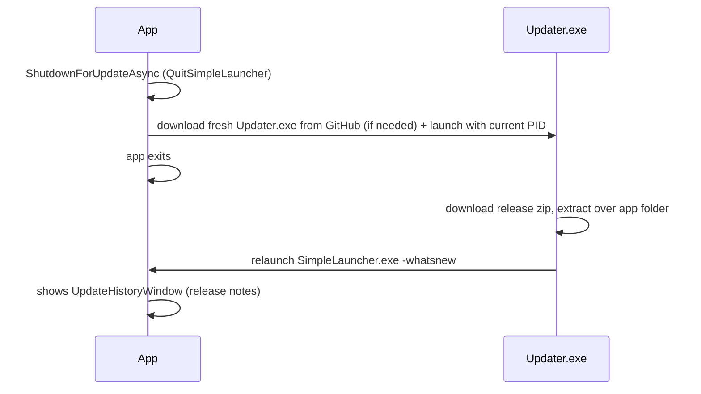

# 16 — Updater

> Update checking, the Updater.exe flow, restart/reinstall.
> Related: [04 — Architecture](04-architecture.md) · [15 — Development](15-development.md)

## Update check (`CheckForUpdatesService`)

`SimpleLauncher\Services\UpdateChecker\` (+ `CheckForUpdatesService`)

- **Silent check** at startup: hits `https://api.github.com/repos/{owner}/{repo}/releases/latest` (`CheckForUpdatesService.cs:89-143`) with a timeout so it can never hang the UI.
- **Manual check**: About window "Check for Updates" (`AboutViewModel` → `ManualCheckForUpdatesAsync`).
- Version comparison against the current `5.6.0`; new version → prompts to download.

## Update assets

- `release_{version}_{rid}.zip` — the new app payload (rid = `win-x64` / `win-arm64`).
- `updater_{rid}.zip` — the standalone `Updater.exe` used when it is not already present.

## Update install flow

- `QuitSimpleLauncher` (`Services\QuitOrReinstall\QuitSimpleLauncher.cs`):
  - `RestartApplicationAsync` (`:33`) — spawns itself with `--restarting`, then shuts down; failed restart → "FailedToRestart" box, app stays alive.
  - `SimpleQuitApplication` (`:70`).
  - `ShutdownForUpdateAsync` (`:78`) — downloads fresh `Updater.exe` from GitHub, launches it with the current PID, kills the app.
- `ReinstallSimpleLauncher` (`Services\QuitOrReinstall\ReinstallSimpleLauncher.cs`):
  - `StartUpdaterAndShutdownAsync` (`:33`, async-void) — launches local `Updater.exe` or downloads it from GitHub, then hard-exits; access-denied (error 5) → correct message box.
- `--restarting` skips single-instance enforcement during startup (`App.xaml.cs:528`); `-whatsnew` shows the release-notes window (`App.xaml.cs:634-651`).

## `SimpleLauncher.Updater` project

Standalone console app (`Updater.exe`) shipped with each release (`version.txt` = `release5.6.0`). Responsibilities: download the release zip for the current RID, extract over the application folder, relaunch the app.

## Related docs

- [04 — Architecture](04-architecture.md) (startup/shutdown lifecycle)
- [15 — Development](15-development.md) (release packaging)
- [17 — Release Notes](17-release-notes.md)
